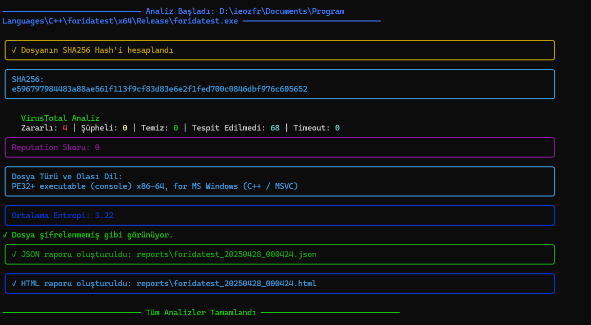
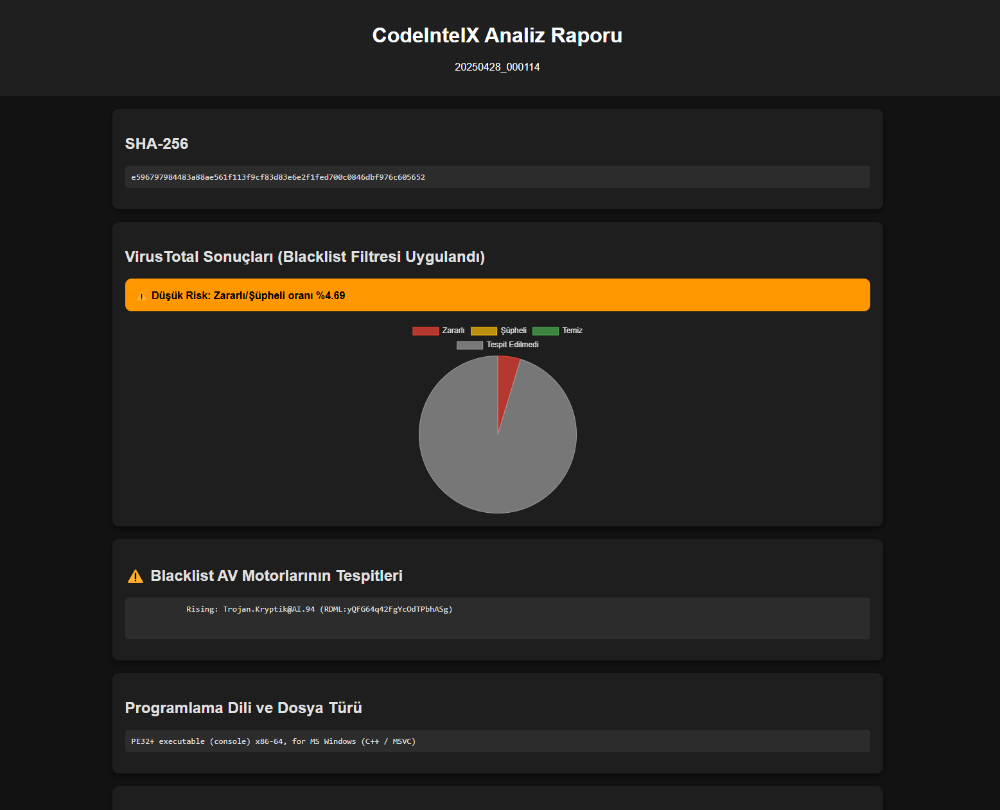

<p align="center">
  
</p>

# CodeIntelX

🚀 CodeIntelX is an open-source professional tool to perform static analysis on executable files.

It provides:
- VirusTotal threat checking with smart risk evaluation
- Blacklist antivirus filtering (no false positives)
- Programming language detection
- Packing/encryption detection
- JSON and HTML report generation
- Dark Mode and responsive stylish HTML reports

---

## 🌍 Multi-language README (EN / TR)

---

## 📖 Project Description (EN)

CodeIntelX analyzes executable files by calculating SHA256, querying VirusTotal with smart risk evaluation, detecting programming language based on file signature, and checking if the file is packed/encrypted.  
It produces detailed reports in JSON and stylish HTML format.

---

## 📖 Proje Tanımı (TR)

CodeIntelX, yürütülebilir dosyaları analiz ederek SHA256 hesaplar, akıllı risk değerlendirmesi ile VirusTotal sorgulaması yapar, dosya imzasına göre programlama dili tespit eder ve dosya şifreli mi değil mi kontrol eder.  
Sonuçları JSON ve şık HTML rapor formatında sunar.

---

## 🚀 Features / Özellikler

- 🔍 VirusTotal risk checking with threshold logic (%10 rule)
- ❌ Ignoring false positives from specific AV engines
- 📦 Packing/Encryption detection via entropy analysis
- 💻 Programming language detection from binary type
- 📝 Stylish, dark mode, animated HTML reporting
- 🗃️ JSON report export
- 🌐 English + Turkish bilingual support (README)

---

## ⚙️ Installation / Kurulum

```bash
git clone https://github.com/yourusername/CodeIntelX.git
cd CodeIntelX
pip install -r requirements.txt
```
## 🔑 VirusTotal API Key Setup
Edit src/config/settings.json like this:
```bash
{
  "VIRUSTOTAL_API_KEY": "your_virustotal_api_key_here"
}
```
## 🛠️ Usage / Kullanım
Analyze a single file:
```bash
python -m src.main -f "path/to/your/file.exe"
``` 
Or analyze a directory:
```bash
python -m src.main -d "path/to/your/directory"
```
Reports will be generated under the reports/ folder.

## 📸 Screenshots / Ekran Görüntüleri

<p align="center">  </p> <p align="center">  </p>

## 🤝 Contribution / Katkıda Bulunma
Feel free to contribute by pull requests, bug reports or feature suggestions!
Projeye katkıda bulunabilirsiniz! 🎯

## 📜 License
This project is licensed under the MIT License.

